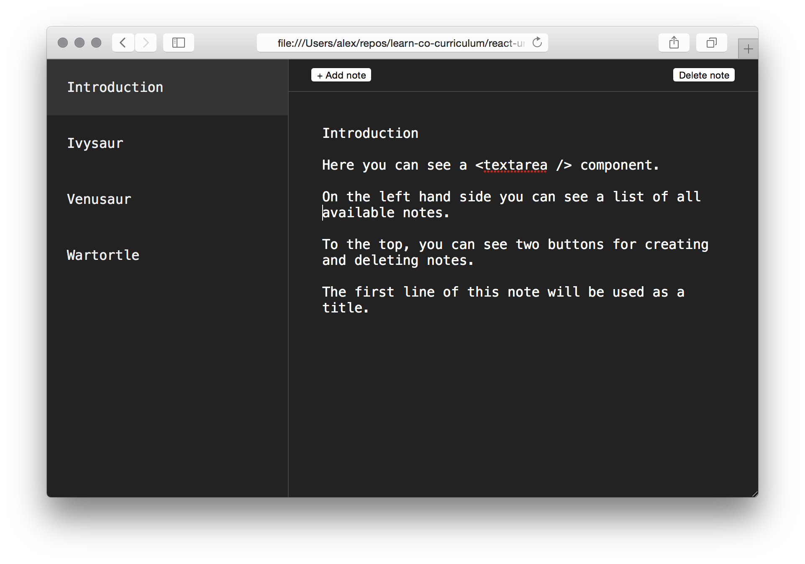
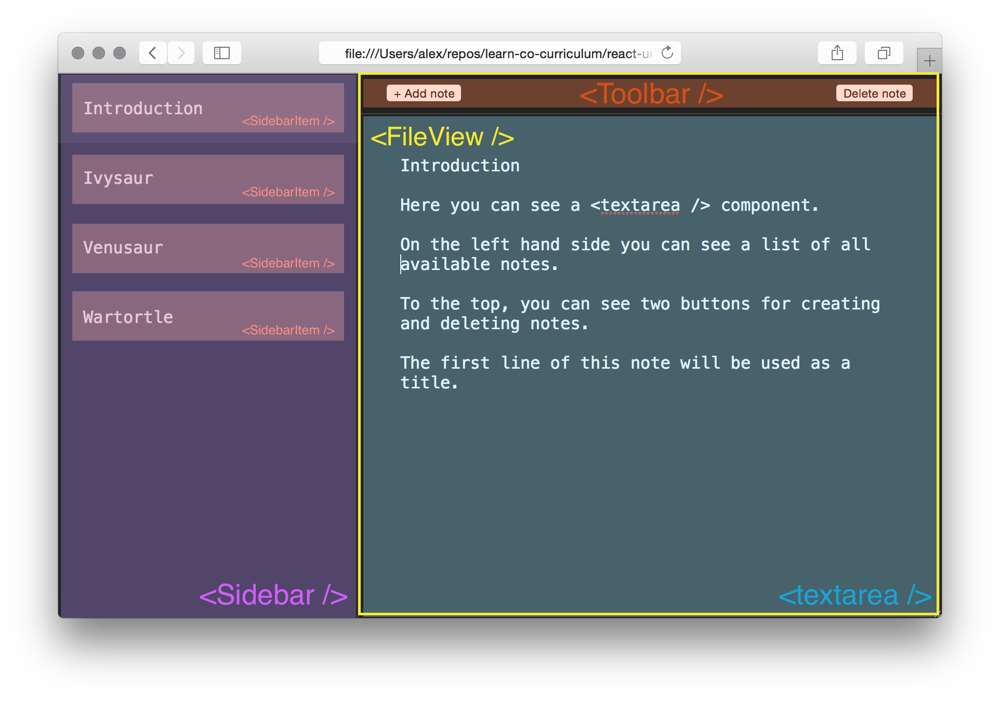

# React Unidirectional Data Lab

## Objectives

1. Coordinate components, actions, and stores to create a unidirectional data
   flow
2. Practice modularizing React applications

## Overview

In this lab we're going to practice modularizing component architectures by
building a note taking application.

This is how it's going to look like:

## Components

Our application consists of a couple of components that we're going to implement
as part of this lab. As usual, the tests will guide us while building them out.

### `<App />`

The primary container of our application is the `<App />` component.
`<App />` adds a listener to the `fileStore` store when being mounted.

The `<App />` component has two child components: `<Sidebar />` and
`<FileView />`.

### `<Sidebar />`

`<Sidebar />` contains a list of all available notes.

It doesn't subscribe to the store directly, but instead receives the `files`
prop from the `<App />` component. `<Sidebar />` is stateless. It renders a list
of `<SidebarItem />` components.

### `<SidebarItem />`

A `<SidebarItem />` represents a single note entry in the sidebar. If the note
is currently selected, it should have a light background (don't worry about the
styling, the CSS is taken care of).

### `<FileView />`

On the right hand side of the app, we can see the so-called "FileView". The
`<FileView />` component renders a single file.

Our users can edit the file by entering text into the `<textarea />`.

### `<Toolbar />`

On the top, we can see a toolbar. The `<Toolbar />` component contains two
buttons. When a user click on the "Add note" button, a new file is being added
to the end of the `fileStore`. When a user clicks the "Remove note" button, the
currently selected file should be deleted from the `fileStore`.

There should always be at least one file in the sidebar. If the user attempts to
delete the last remaining note, we simply clear the file instead of deleting the
note.

## Stores

Our editor uses a single `fileStore` singleton. `fileStore` inherits from
`Store`, which implements a generic store.

## Resources

- [Why does React emphasize unidirectional data?](https://hashnode.com/post/why-does-react-emphasize-on-unidirectional-data-flow-and-flux-architecture-ciibz8ej600n2j3xtxgc0n1f0)
